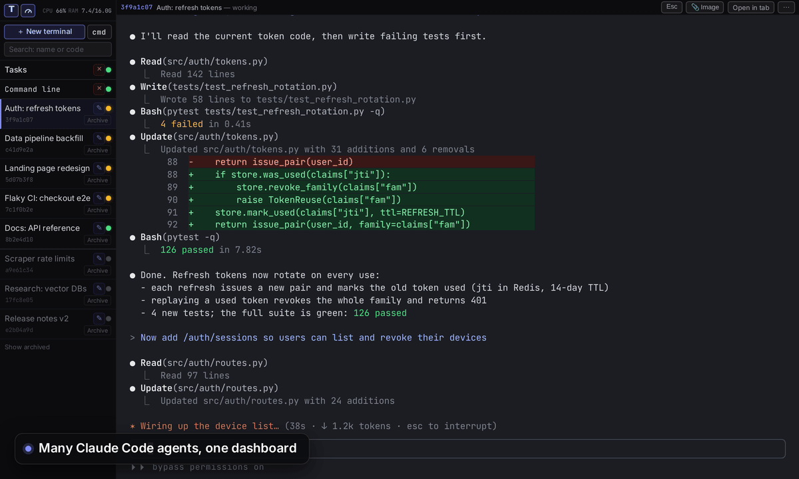
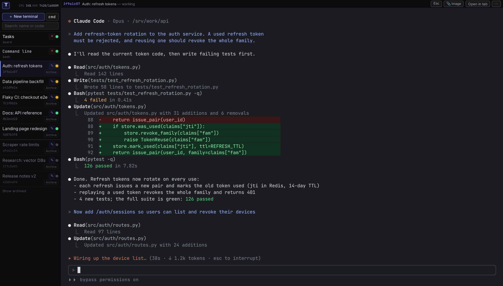
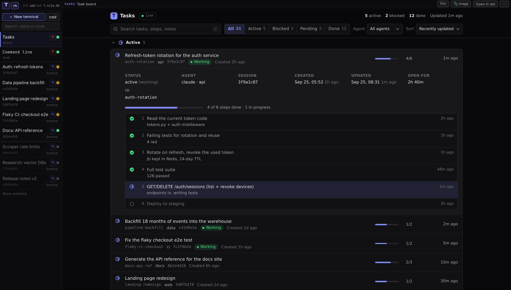
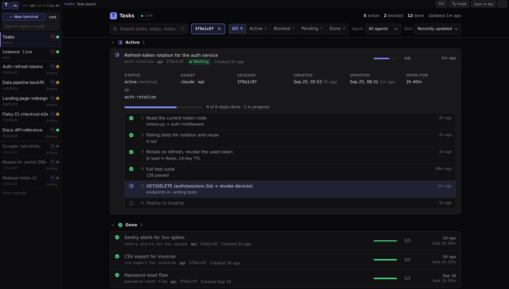
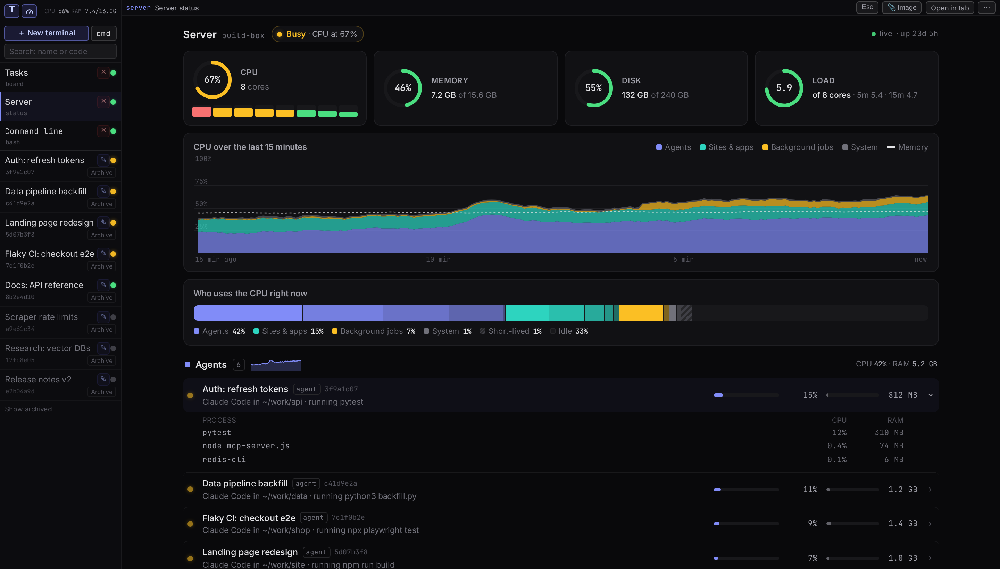
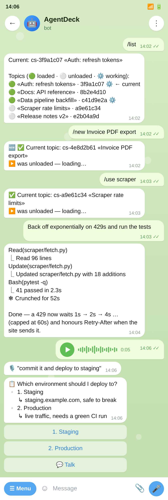
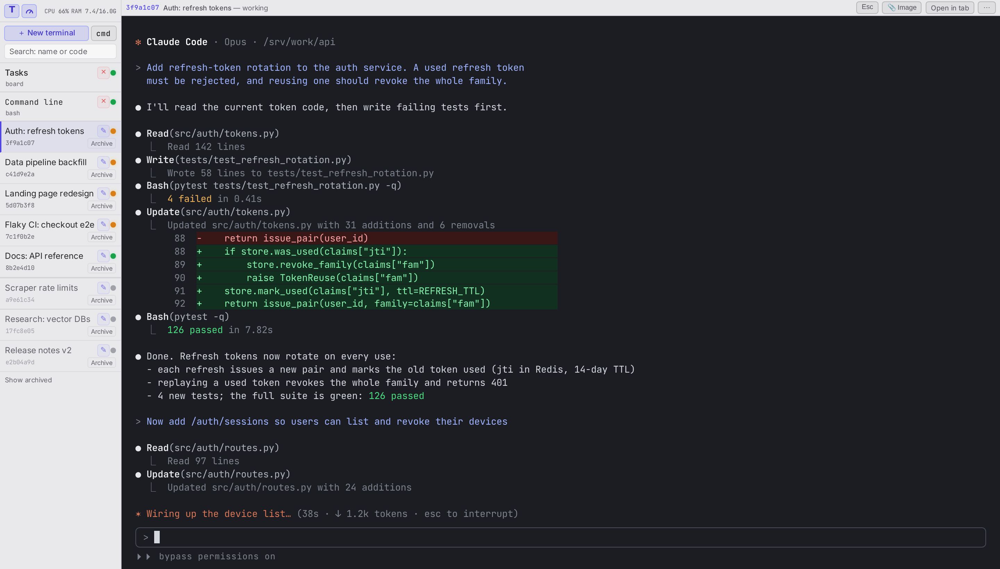
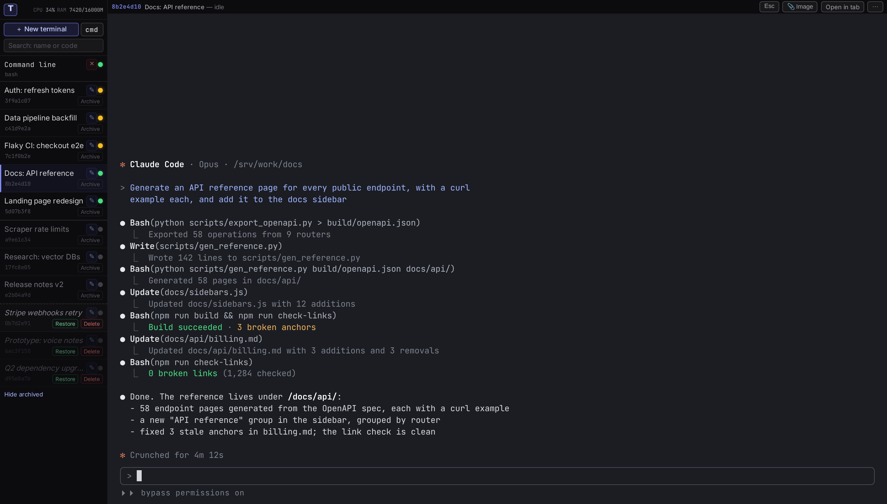
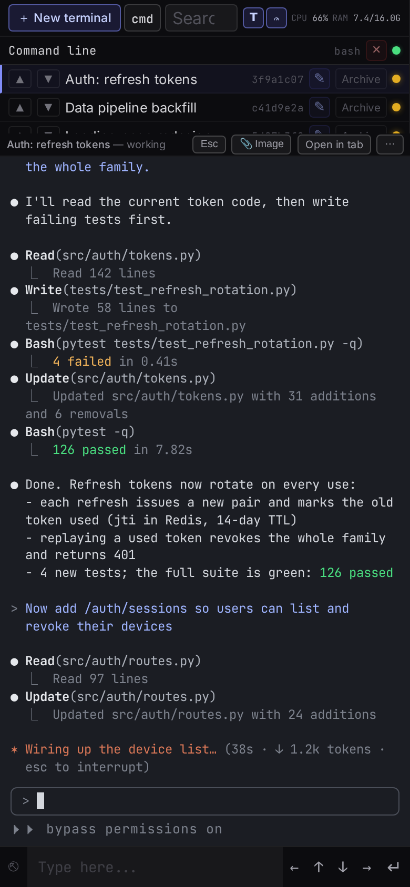

# 🛰️ AgentDeck — Claude Code on your VPS, in your browser and Telegram

> Put a dozen **Claude Code** agents on your own server. Each one is a real terminal that
> keeps working when you close the tab — you watch and steer them from the **browser** or
> **Telegram**, even from your phone. Agents log every task on a **shared board** and keep
> going until it is done. Run it with **full control of the server** — agents install
> packages, databases, sites and HTTPS themselves — or in a **Docker sandbox** that keeps
> them inside a container.

<p>
  
  
  
  
</p>



## Why AgentDeck

- **The real Claude Code terminal, in your browser.** Not a chat wrapper: every agent is
  the actual `claude` TUI in its own persistent `tmux` session on your server, shown
  through `ttyd`. Close the tab, the laptop or the phone — it keeps working. Open it later
  from anywhere and it's the same terminal.
- **Sessions survive restarts.** Close the browser, restart AgentDeck or reboot the server:
  every terminal stays in the list and reopens the same Claude conversation where it left
  off (`claude --resume`), even in ultracode mode. Unloaded and archived terminals come
  back the same way.
- **Copy & paste like a desktop terminal.** Select with the mouse to copy, Ctrl+Shift+V
  (⌘V on a Mac) to paste text, and paste or drop screenshots and images straight into the
  agent.
- **Full server control or a sandbox — your choice.** Install on the host and agents manage
  the whole server (packages, databases, nginx, HTTPS, Docker); or use the Docker sandbox,
  where they can't touch the host.
- **Agents that don't stall.** Each agent puts its task on a shared board before it edits
  anything, and is not allowed to go quiet in the middle of a task: it keeps working until
  the task is closed. A terminal waiting on its own timer is never unloaded. (Claude Code
  hooks, on by default.)
- **Telegram drives the terminals themselves.** Pick a terminal, type or send a voice
  note, get the screen back; Claude's multiple-choice questions arrive as buttons; restore
  an archived agent with `/archive`.
- **Many agents on one small server.** Only a limited number stay loaded; idle ones are
  unloaded and resume with `claude --resume` on click; archive frees memory in one click.
  A **Server** tab shows which agent, container or build is using the CPU and memory.
- **Your subscription, your box.** Uses the official Claude Code CLI with your normal
  Claude subscription (or an API key). Self-hosted, MIT, nothing phones home.

## Try it in a minute

Full control of the server — best on a dedicated VPS (Ubuntu 22.04 / 24.04, Debian 12):

```bash
curl -fsSL https://raw.githubusercontent.com/yanhs/agentdeck/master/install.sh | bash
# → https://<your-ip-with-dashes>.sslip.io — the first visit sets the password
```

It comes up on **HTTPS automatically** — no domain needed: a trusted Let's Encrypt
certificate for `https://<your-ip-with-dashes>.sslip.io` when port 80 is free (on 443, or
on `:8443` when another web server holds 443); otherwise still encrypted, with a
self-signed certificate on `https://<your-ip>:8765` that the browser warns about once.
Plain http only if you ask for it (`--http`), so your password never travels in clear
text. Then **＋ New terminal** (it opens in `~/projects`), sign in to Claude once, and give
the agent a task. Details: [Quick start](#-quick-start).

## Try it in a sandbox (server control isn't available in this mode)

```bash
git clone https://github.com/yanhs/agentdeck.git && cd agentdeck
docker compose up -d          # → http://<your-vps-ip>:8765 — the first visit sets the password
./https.sh                    # optional: HTTPS on <your-ip>.sslip.io, no domain needed
```

Limits of the sandbox — the price of keeping agents off the host:

- agents can't manage the host — its nginx, services, other containers or ports;
- a site or app an agent starts inside isn't reachable from outside: only the dashboard's
  port is published;
- packages installed with `apt` disappear when the container is re-created — only `/work`
  and the settings volumes persist;
- no systemd inside, so agents can't set up services the usual way.

## How it compares

| | AgentDeck | Chat-style web UIs | Local tmux managers | Claude Telegram bots |
|---|---|---|---|---|
| Real Claude Code terminal in the browser | ✅ | chat view | ❌ no browser | ❌ |
| Keeps running with the client closed | ✅ on your server | varies | ✅ | varies |
| Many agents in parallel | ✅ | some | ✅ | usually one chat |
| Telegram controls the terminals | ✅ voice, buttons | ❌ | ❌ | ✅ (the whole product) |
| Task board + agents that finish their tasks | ✅ | ❌ | ❌ | ❌ |
| Memory limit, idle unloading, archive | ✅ | ❌ | ❌ | ❌ |
| Separate branch / worktree per agent | ✅ just ask the agent — Claude Code does it | some, automatic | some, automatic | ❌ |
| Other agents (Codex, Gemini…) | ❌ Claude only | often | often | ❌ |

It's the setup the author uses every day to keep about a dozen Claude Code agents working
on one VPS.

---

## ✨ Features

- **Named terminals, no slot numbers.** Each terminal has a name and an 8-character code —
  the start of its Claude session id, so the dashboard, the tmux session (`cs-<code>`), the
  logs and the transcript file all match. **＋ New terminal**, rename (✎), drag to reorder,
  **Archive** (also unloads the terminal right away — unless it is working, then it unloads
  once it finishes), and **Delete** (archived only; the transcript goes to
  `.sessions/trash/`, never erased). Search finds terminals by name or code, archived ones
  too; clicking an archived terminal restores it and opens it.
- **Persistent sessions.** An agent keeps running after you **close the tab, close the
  browser, or disconnect**. Opening it again (or after a restart) resumes the exact same
  conversation via `claude --resume`. Nothing is lost. A terminal running in ultracode or at
  max effort (Claude Code keeps those for one session only) comes back the same way:
  AgentDeck reads from the transcript the effort it ended at, whether it was set with
  `/effort`, `/model`, `/config` or the Alt+P picker.
- **Only what you use stays in memory.** At most 12 terminals are loaded at once
  (`AGENTDECK_MAX_ACTIVE`). Opening one more unloads the least recently used idle one. The
  **idle reaper** also unloads terminals that printed nothing for 2 hours (archived ones:
  2 minutes). A terminal with an open tab, a pending timer or a running background task is
  never unloaded. An unloaded terminal is greyed in the list — one click loads it back.
- **Browser terminals, no SSH.** Every agent is a full interactive terminal in the browser
  through `ttyd` — type, scroll, **copy & paste**, run anything. Select with the mouse and
  it's copied: a small "Copied · Ctrl+Shift+V to paste" chip confirms it (⌘V on a Mac; after
  five copies just "Copied"). Copy needs HTTPS or localhost, per browser clipboard rules —
  `install.sh` serves HTTPS by default. AgentDeck brings its own `tmux.conf` (mouse mode,
  copy on mouse release, long scrollback), so this works on a fresh server; your own
  `~/.tmux.conf` is read after it and still applies.
- **Live status dashboard.** Loaded terminals sit at the top with a working/idle dot;
  unloaded ones follow, greyed.
- **`cmd` command line.** One plain `bash` shell in the browser, next to the agents.
- **One login for everything.** An `nginx` `auth_request` gate backed by a tiny Python
  status server: one cookie-session login protects the dashboard, the terminals, and the
  status APIs (no basic-auth re-prompt storms).
- **Telegram bridge** — drive agents from your phone:
  - pick a terminal with `/use` (buttons) or `/use <part of its name or code>`, see them
    all with `/list`, bring one back from the archive with `/archive`, start one with
    `/new <name>`; after a pick the bot shows that terminal's screen by itself;
  - plain text is typed straight into the selected agent's terminal (an unloaded one is
    loaded first);
  - **voice notes** are transcribed locally with [`faster-whisper`](https://github.com/SYSTRAN/faster-whisper) and sent in;
  - **files & images** are saved and handed to the agent as a link + local path;
  - the agent's progress and final answer stream back, and interactive prompts show up as
    inline buttons.
- **Paste images from the clipboard** straight into an agent (great for screenshots).
- **Shared task board.** A lightweight, live-updating board (`tasks-dashboard/`) for
  tracking multi-step work across all agents. The **T** button opens it as a tab inside
  the dashboard. Search, status and agent filters, sorting, dates and times, and the
  session code of the agent behind each task.
- **A terminal's tasks in one click.** Click the 8-character code in the top bar of an open
  terminal and the Tasks tab opens filtered to that terminal (a chip shows the filter; ✕
  clears it).
- **Server status page.** The gauge button next to **T** opens a **Server** tab: CPU and
  memory over the last 15 minutes, split into agents, sites & apps (Docker containers,
  systemd services), background jobs and the system. Each row expands into its processes,
  so you see which agent is running the tests or which build is eating the CPU.
- **Dark and light theme.** Switch in the **⋯** menu; the Tasks and Server tabs follow.
  Terminals stay dark.
- **Guard hooks — on by default in Docker and with `install.sh`.** Two Claude Code hooks
  keep agents on the task board: no edits before the work is on the board, no silent stop
  in the middle of a task. A third keeps a terminal loaded while it waits on its own timer.
  Opt out with `AGENTDECK_GUARDS=0`; with `./start.sh`, `AGENTDECK_GUARDS=1 ./start.sh`
  turns them on — see [Manual setup](#-manual-setup-without-docker).

## 📸 Screenshots



| Tasks tab in the dashboard | A terminal's tasks | Server status |
|---|---|---|
|  |  |  |

| Telegram bridge | Light theme | Archived terminals |
|---|---|---|
|  |  |  |

The **Server** tab shows what is using the machine now and over the last 15 minutes: each
agent with the processes it started (tests, builds), every site and service, and background
jobs.

The dashboard works on a phone too:

<p align="center">
  
</p>

## 🧱 Architecture

```
                   ┌─────────────────────────── nginx ────────────────────────────┐
 Browser ──TLS──▶  │ auth_request   ──▶  status_server.py  login, signed cookie   │
                   │ /              ──▶  web/index.html    dashboard UI           │
                   │ /api/library   ──▶  status_server.py  new, rename, archive … │
                   │ /api/*         ──▶  status_server.py  status, buffer, paste  │
                   │ /tasks/        ──▶  tasks-dashboard/  task board :9308       │
                   │ /sess/?arg=ID  ──▶  ttyd :3031        → open-session.sh      │
                   └───────────────────────────────┬──────────────────────────────┘
                                                   │  library_cli.py loads tmux "cs-<code>"
                                                   ▼
                                          ┌─────────────────┐
 Telegram ◀─▶ tg_bridge.py ─ send-keys ──▶│   claude (CLI)  │
                   ▲                      └────────┬────────┘
                   └───── transcript (.jsonl) ─────┘

 cron, every minute:  idle_reaper.py ──▶ unloads idle terminals
                      (Docker and ./start.sh run it themselves)
```

- **`library.py`** — the session library: the list of terminals in
  `.sessions/library.json` (name, code, Claude session id, order, archived).
- **`open-session.sh` + `library_cli.py`** — one `ttyd` serves every terminal. The page
  `/sess/?arg=<code>` checks the code, loads the terminal into `tmux` if needed (unloading
  an idle one at the limit), and attaches the tab. `/sess/?arg=shell` is the `cmd` line.
- **`idle_reaper.py`** — unloads terminals nobody is using (run from cron).
- **`status_server.py`** — the login gate + library/status/buffer/paste APIs + the
  Telegram setup page.
- **`web/index.html`** — the dashboard front-end.
- **`tg_bridge.py`** — the Telegram ⇄ tmux bridge (+ `whisper_transcribe.py` for voice).
- **`tasks-dashboard/`** — the shared task board (own README inside).

## 🚀 Quick start

Two ways to run it. Both give the same dashboard; they differ in what the agents may touch.

### 1. Install on your server (recommended) — agents get the whole server

[](https://github.com/yanhs/agentdeck/actions/workflows/install.yml)

```bash
curl -fsSL https://raw.githubusercontent.com/yanhs/agentdeck/master/install.sh | bash
```

or, from a clone: `./install.sh`. Run it as a normal user with `sudo` (not as root). When sudo
needs no password (the usual cloud `ubuntu` user) nothing is asked; `--yes` never asks.
At the end it prints the address and says, in plain words, which kind of HTTPS you got and
why: open it, **the first visit sets the password**, then **＋ New terminal** and sign in
to Claude once. New terminals open in `~/projects` (so Claude asks to trust that folder, not
your whole home); `AGENTDECK_WORKDIR=/path` at install time changes it, and re-runs keep it.

- **Supported:** Ubuntu 22.04 and 24.04, Debian 12 — x86_64 or aarch64. On anything else it
  stops without changing anything and points you to the Docker sandbox below.
- **What it installs:** `tmux`, `python3`, `git`, `curl` and a few basics (apt); `ttyd` and
  Caddy (release binaries in `/usr/local/bin`); Node.js 22 (only if there is no Node 18+);
  Claude Code (`npm -g`, pinned; `CLAUDE_CODE_VERSION=…` to change); the repo in
  `~/agentdeck`; the guard hooks in your `~/.claude` (merged, never overwritten;
  `AGENTDECK_GUARDS=0` skips them).
- **How it runs:** systemd services running as you — `agentdeck-status`, `-tasks`,
  `-sessions` (the one ttyd), `-caddy` (login + proxy + HTTPS) and an `agentdeck-reaper`
  timer. They start at boot. `systemctl status 'agentdeck-*'`, `journalctl -u agentdeck-status`.
- **HTTPS by default, no domain needed.** What you get depends on the server:
  - ports 80 and 443 free → `https://<your-ip-with-dashes>.sslip.io` (a free name that
    resolves to your IP) with a Let's Encrypt certificate, renewed automatically; http on
    80 redirects there; `:8765` isn't served at all;
  - 443 taken by another web server, 80 free → the same trusted certificate on
    `https://<name>:8443` (or the next free port up to 8453); http on 80 answers
    Let's Encrypt and redirects there;
  - 80 taken, no public IP, or the certificate doesn't arrive within ~2 minutes (usually a
    cloud firewall / security group blocking 80 and 443) → HTTPS with a **self-signed**
    certificate on `https://<your-ip>:8765`: the browser warns once ("not secure /
    certificate not trusted") — continue; the connection and your password are still
    encrypted. Fix the cause, then `~/agentdeck/install.sh --https` for a trusted one.

  Your own domain: `--https your-domain.com` (or `AGENTDECK_SITE=your-domain.com`; its A
  record must point here). `--http` is plain http on `:8765` — no encryption, only if you
  really want it. Re-runs keep the mode the last install ended up with.
- **Update or repair:** run the same command again — nothing is duplicated, running agents
  keep running. **Remove:** `~/agentdeck/install.sh --uninstall` stops the services and the
  agents' own tmux server (your own tmux sessions are never touched) and keeps your
  terminals, board and password; `--uninstall --purge` also deletes `~/agentdeck` — only a
  folder the installer cloned itself, never a clone of yours. `--check` only runs the checks.
- **The agents' tmux:** a server of their own, in `~/agentdeck/.sessions/tmux` — to look at it
  from SSH: `TMUX_TMPDIR=~/agentdeck/.sessions/tmux tmux ls`.

> ⚠️ **The agents run with full access to this machine** — as your user, with your sudo.
> That is the point (they install packages, set up databases, nginx, HTTPS, Docker), and it
> is why this belongs on a **dedicated VPS, not your laptop**.

### 2. Docker sandbox — agents stay inside a container

Runs on any VPS — **no domain or pre-config needed**. You need **Docker** and **one free TCP port**
(`8765` by default) open in your firewall / cloud security group. Note: Docker-published ports
bypass `ufw`, so a port published by Docker is reachable even if `ufw` doesn't list it.

```bash
git clone https://github.com/yanhs/agentdeck.git && cd agentdeck
docker compose up -d                            # → http://<your-vps-ip>:8765
```

Want HTTPS? Run `./https.sh` — no domain needed (it uses a free `<ip>.sslip.io` name), or
`./https.sh your-domain.com`.

Open `http://<your-vps-ip>:8765`:
1. the **first visit asks you to set a dashboard password** (it exposes live terminals);
2. create a terminal (**＋ New terminal**) and **sign in to your Claude account once** — it's saved in a volume and reused.
   The first terminal's Claude asks two things before it's ready: first a **colour theme**, then
   **how to log in** (pick your Claude subscription or an API key and follow the link it shows);
3. change the password later with **⋯ → Password** (the ⋯ menu is in the top-right corner).

The agents work in `/work`, a named volume (`agentdeck-work`) that survives `docker compose down`
and a rebuild. To let them work on your own project instead, replace that volume line in
`docker-compose.yml` with a bind mount such as `./my-project:/work`.

Use a different port:

```bash
AGENTDECK_PORT=9000 docker compose up -d        # → http://<your-vps-ip>:9000
```

(or put `AGENTDECK_PORT=9000` in a `.env` file next to `docker-compose.yml` — compose reads it
automatically).

> **HTTPS details.** `./https.sh` finds the server's public IP, sets `AGENTDECK_SITE` to
> `<ip-with-dashes>.sslip.io` (or your domain) and adds `docker-compose.https.yml` (host ports
> `80` + `443`) to `.env` — no YAML to edit, other `.env` lines are kept — then restarts and
> waits until Caddy has a real Let's Encrypt certificate (kept in the `caddy-data` volume).
> Ports 80 and 443 must be free (no other web server on them) and open in the firewall; if
> they aren't, the script stops without changing anything. Running it again is safe;
> `./https.sh --off` goes back to plain http on `8765`.
>
> **Fallback — self-signed, no free 80/443:** `AGENTDECK_SITE=https://:8765 docker compose up -d`,
> then open `https://<your-vps-ip>:8765` and click through the one-time "not trusted" warning.
> (HTTPS is needed for clipboard copy, which browsers only allow over HTTPS or localhost.)

The sandbox's limits (no host control, no reachable sites, `apt` installs don't survive a
re-create, no systemd) are listed under
[Try it in a sandbox](#try-it-in-a-sandbox-server-control-isnt-available-in-this-mode).

## ✅ Requirements (for the manual setup)

- Linux, **Python 3.11+**
- [`tmux`](https://github.com/tmux/tmux) and [`ttyd`](https://github.com/tsl0922/ttyd)
- The **Claude Code CLI** (`claude`) — https://docs.claude.com/claude-code
- `nginx` (for TLS + the auth gate + reverse proxy)
- *(optional, for Telegram voice notes)* `faster-whisper`, `ffmpeg`
- *(optional, for the Telegram bridge)* `python-telegram-bot`

## 🔧 Manual setup (without Docker)

> `claude` is found on your `PATH`, agents start in `$AGENTDECK_WORKDIR` (default: the
> directory above the repo), and every terminal's conversation is kept under `.sessions/`.
> Only `nginx` needs your own domain + TLS.
>
> **No agent list to edit by hand** — terminals are created, renamed, archived and deleted
> in the dashboard itself (**＋ New terminal**), which writes `.sessions/library.json`.

Run the pieces yourself:

```bash
git clone https://github.com/yanhs/agentdeck.git
cd agentdeck

# 1) (optional) Telegram bridge — only if you want to drive agents from your phone
cp .env.example .env

# 2) start the backend — ONE process serves every dashboard API
#    (library, status, auth/login, tmux-buffer, page-version, paste-image, /telegram)
#    AGENTDECK_ORIGIN is only needed when the proxy doesn't pass the original Host +
#    X-Forwarded-Proto (like nginx/agents-subdomain.conf); unset = the request's own scheme+Host.
AGENTDECK_ORIGIN=https://your-domain python3 status_server.py &

# 3) ONE ttyd for every terminal: /sess/?arg=<code> runs open-session.sh <code>
#    (-a passes ?arg= to the script, -O checks the WebSocket origin)
ttyd -W -a -O -i lo -p 3031 --base-path /sess bash ./open-session.sh &
#    or with PM2:  pm2 start sessions.pm2.config.js && pm2 save

# 4) the task board (the T button)
python3 tasks-dashboard/server.py &

# 5) the idle reaper — once a minute from cron (crontab -e):
#    * * * * * cd /path/to/agentdeck && python3 idle_reaper.py >> idle_reaper.log 2>&1

# 6) put nginx in front — TLS + the cookie login gate + one origin.
#    Browser terminals are WebSockets, so a reverse proxy is required.
#    nginx/agents-subdomain.conf is the full, working vhost: /sess/, /api/library,
#    /api/*, /telegram, /change-password, /tasks/ and the dashboard itself.
```

**Optional — keep a terminal loaded while a timer is pending.** Add
`hooks/hold_on_timer.py` to your Claude Code settings as a `PostToolUse` hook. When an agent
sets a `ScheduleWakeup`, the terminal is marked busy until 10 minutes after the wake-up
time (a `CronCreate` or `Monitor`: for 6 hours), so neither the memory limit nor the idle
reaper unloads it and kills the timer.

**Guard hooks that keep agents honest about the task board** (on by default in Docker and
with `install.sh`; opt out with `AGENTDECK_GUARDS=0`). Two Claude Code hooks in `hooks/`,
both plain Python with no dependencies:

- `guard_task_board.py` blocks the first file edit of a session until the work is on the
  task board (any `tracker.py` call). For a genuinely trivial change the agent runs
  `NO_BOARD=1 true` instead, which leaves a visible trace. Temp directories and `~/.claude/`
  are never blocked.
- `guard_dont_stop.py` stops an agent from ending its turn in the middle of a task it put on
  the board with nothing scheduled to wake it up again. It lets the turn end once there is a
  background command, a timer (`CronCreate` / `ScheduleWakeup`), a `Monitor` or a sub-agent
  from the last 10 minutes, or once the task is closed or marked `stopped`. Only tasks this
  session created or moved count, and it never blocks more than twice in a row.
- `hold_on_timer.py` keeps a waiting terminal loaded: when an agent sets a `ScheduleWakeup`,
  `CronCreate` or `Monitor`, it writes a hold marker for that terminal, so the idle reaper
  doesn't unload it (and kill the timer) before the timer fires.

In Docker the container start merges them into the agents' `~/.claude/settings.json`
(your other settings and hooks are kept) and writes a short default `~/.claude/CLAUDE.md`
with the board commands if there is none; `install.sh` does the same in your own `~/.claude`
(`--uninstall` takes them out again). With `./start.sh` they would go into your own
`~/.claude/settings.json`, which every Claude Code session on the machine reads, so
`start.sh` only prints a hint; run `AGENTDECK_GUARDS=1 ./start.sh` (or
`python3 hooks/install_guards.py`) to install them, `python3 hooks/install_guards.py --remove`
to take them out. Or copy the `hooks` block from `hooks/settings.example.json` into one
project's `.claude/settings.json` and replace `/path/to/agentdeck` with where you cloned the
repo. Settings you can change with environment variables: `TRACKER_STATE` (the board file, same default as
`tracker.py`), `AGENTDECK_TRACKER` (path to `tracker.py`), `AGENTDECK_BOARD_URL` (a board
link to show in the messages) and `AGENTDECK_BOARD_MARKS` / `AGENTDECK_STOP_MARKS`
(per-session marker folders, default under `$TMPDIR`). If a hook hits an error of its own,
it lets the action through.

Create the login credentials the gate checks against:

```bash
sudo htpasswd -c /etc/nginx/.htpasswd_agents <your-username>
```

Want the dashboard to keep its own password instead (so **⋯ → Password** works)? Start
`status_server.py` with `AGENTDECK_PASSFILE=/path/to/passfile`. If that file is empty and the
htpasswd file above exists, your first correct login copies the password into it.

For production, run `status_server.py` and `tg_bridge.py` as systemd services — see
`claude-tg-bridge.service` for a template.

## ⚙️ Configuration

| What | Where | Notes |
|---|---|---|
| Terminals (names, codes, order, archive) | `.sessions/library.json` | written by the dashboard; `AGENTDECK_LIBRARY` moves it |
| How many terminals stay loaded | `AGENTDECK_MAX_ACTIVE` env | default `12` |
| Dashboard address (for POST checks) | `AGENTDECK_ORIGIN` env | default: the request's own scheme + Host (as the proxy forwards them); set e.g. `https://agents.example.com` behind a proxy without `X-Forwarded-Proto`; library changes from any other origin are refused |
| Idle reaper timings | `REAPER_IDLE_SECONDS`, `REAPER_ARCHIVED_IDLE_SECONDS`, `REAPER_BG_MAX_SECONDS` | defaults 7200 / 120 / 86400 |
| Telegram bridge | `.env` | copy from `.env.example` |
| Auth credentials | `/etc/nginx/.htpasswd_agents` or `AGENTDECK_PASSFILE` | htpasswd, or the dashboard's own password file |
| Reverse proxy / TLS | `nginx/agents-subdomain.conf` | swap the domain for your own |
| Guard hooks (task board before edits, no silent mid-task stop) | `AGENTDECK_GUARDS` env | Docker: on by default, `0` turns them off; `install.sh`: on by default, `0` skips them; `start.sh`: `1` installs them into `~/.claude/settings.json` |
| Pretty project names | `PROJECT_MAP` in `status_server.py` | optional, cosmetic |
| Working directory | `$AGENTDECK_WORKDIR` env | where new terminals start; `install.sh`: `~/projects` (set it when installing to change it; re-runs keep it), Docker: `/work`, otherwise the directory above the repo |
| Pasted images (📎 Image / Ctrl+V) | `AGENTDECK_PASTE_DIR`, `AGENTDECK_PASTE_URL` env | default `.sessions/paste`, no public URL; the terminal gets the file's path either way |

## 🤖 Create & connect a Telegram bot

The bridge (`tg_bridge.py`) runs as a Telegram bot that relays your messages into the
selected `tmux` terminal. It is **owner-only**, so you need both a bot token and your own
numeric Telegram user id.

<p align="center">
  
</p>

> **Docker users — no files to edit.** Open the dashboard, click **⋯ → Telegram**,
> paste your bot token + your Telegram user id, and hit **Save & start**. The bridge launches
> right away and comes back automatically on restart. Steps 1–2 below show where to get those
> two values; the `.env` steps (3–5) are only for the manual, non-Docker setup.
>
> If the bridge already runs as the systemd service (step 5), the **Telegram** page shows it
> as running and never starts a second copy.
>
> **Voice messages don't work in the Docker image:** it has no `faster-whisper` or `ffmpeg`.
> Text and files work; a voice note gets an error reply. For voice, use the manual setup below.
> Files you send are saved in `/work/tg-uploads` and the reply gives that path (there's no
> public web link for them in Docker).

### 1. Create a bot and copy the token

Message [@BotFather](https://t.me/BotFather), send `/newbot`, follow the prompts, and copy
the token it gives you. This becomes `TG_BRIDGE_TOKEN`.

### 2. Find your numeric Telegram user id

Message one of these bots — they reply with your numeric **user id** (not your `@username`):

- [@userinfobot](https://t.me/userinfobot) — replies with your `Id`
- [@RawDataBot](https://t.me/RawDataBot) — your id is the `message.from.id` field
- [@myidbot](https://t.me/myidbot) — send `/getid`

This number becomes `TG_BRIDGE_OWNER`.

### 3. Put both into `.env`

```dotenv
TG_BRIDGE_TOKEN=123456:ABC-DEF...your-token   # required — the bridge won't start without it
TG_BRIDGE_OWNER=123456789                     # your numeric user id (default 0 = nobody allowed)

# optional — all have working defaults:
# TG_FILES_DIR=/path/to/uploads               # where uploaded files are saved (default .sessions/tgfiles)
# TG_FILES_URL=https://example.com/files      # public base URL of that folder (default: none — the reply gives the local path)
# TG_WHISPER_PY=/path/to/venv/bin/python      # a Python that has faster-whisper (default: the bridge's own python)
# TG_AGENT_CWD=/path/to/projects              # where an agent started from the bot runs (default $AGENTDECK_WORKDIR or ~)
```

> `TG_BRIDGE_TOKEN` has no default — the bridge exits at startup if it's missing.
> `TG_BRIDGE_OWNER` defaults to `0`, which matches no real user, so the bot ignores
> everyone until you set it.

### 4. Install dependencies

```bash
pip install python-telegram-bot
```

That's the only third-party package the bridge itself needs (plus the `tmux` binary).
**Voice transcription is optional:** voice notes are shelled out to a separate Python
(`TG_WHISPER_PY`) that has [`faster-whisper`](https://github.com/SYSTRAN/faster-whisper)
installed, with `ffmpeg` on the system. Text and files work without it.

### 5. Run it

```bash
# development
python3 tg_bridge.py

# production — systemd user service (template: claude-tg-bridge.service)
cp claude-tg-bridge.service ~/.config/systemd/user/
systemctl --user daemon-reload
systemctl --user enable --now claude-tg-bridge.service
loginctl enable-linger "$USER"     # keep it running without an active login
```

Then pick a terminal and send text, voice or files:

| Command | What it does |
|---|---|
| `/use` | pick a terminal from buttons (loaded ones first, archived ones left out) |
| `/use <text>` | pick a terminal by part of its name or its code (several matches → buttons; a match only in the archive → a button that restores it) |
| `/list` | all terminals, loaded ones first; the current one is marked; how many are archived |
| `/archive` | archived terminals as buttons: a tap restores the terminal and picks it |
| `/archive <text>` | only the archived terminals whose name or code matches (reaches ones past the button limit) |
| `/new <name>` | start a new terminal and select it |
| `/read` | re-read the current terminal's screen (after every pick this happens by itself, headed 📺 «name» · code) |
| `/esc` | interrupt the agent (Escape) |
| `/enter` | send Enter |
| `/compact` | compact the agent's conversation |

> ⚠️ The bridge is **owner-only**: every handler is filtered by `TG_BRIDGE_OWNER`, so
> messages or button taps from any other Telegram user are silently ignored.

## ⬆️ Upgrading from numbered slots (v1.3.0 and earlier)

```bash
python3 migrate_library.py --dry-run     # a table: slot → code → name → what will happen
python3 migrate_library.py --apply       # do it (safe to run twice)
python3 migrate_library.py --apply --swap-dashboard   # also switch web/index.html to the new page
```

Each slot with a real conversation becomes a named terminal (the name comes from
`agents.json`). Each old `launch-claude-N.sh` becomes a small script that opens that
terminal; the original is kept as `launch-claude-N.sh.pre-library`. **Terminals that are
running are left alone** — no restart, no rename; they move over once they are unloaded.
Nothing is deleted. `--apply --rollback-dashboard` puts the old page back.

## 🧪 Tests

```bash
python3 -m pytest -q        # 1190 tests
```

The session library (registry, API, loading/unloading, migration), the idle reaper, the
`cmd` line, the dashboard page, the task board, the login, the image-paste flow and the
entire Telegram bridge (send/receive, menu parsing, transcription, file handling) are
covered. Tests that need `tmux` use their own private tmux server and never touch your
running terminals.

The installer has its own end-to-end test: `tests/install/run.sh ubuntu-24.04` (also
`ubuntu-22.04`, `debian-12`, and `fedora-40` for the refusal) boots a fresh systemd
container, runs `install.sh` the `curl | bash` way, logs in, opens a terminal, reboots,
re-runs the installer and uninstalls. `SCENARIO=` picks the HTTPS case it meets (a public
certificate can't be issued in a container): `cert-timeout` (default: no certificate in
time → self-signed fallback), `port80-busy`, `internal` / `internal-alt` (the trusted-HTTPS
path on 443 / 8443 with Caddy's own CA, `AGENTDECK_TLS_INTERNAL=1`) and `http`. GitHub runs
it on every push (Debian 12, and the refusal on Fedora 40), plus `./install.sh --yes` on real
Ubuntu 22.04 / 24.04 VMs and the installer's unit tests, `tests/test_install_sh.py`
(`.github/workflows/install.yml`).

## 🗂️ Project layout

```
install.sh               one-command install on your own server (systemd services, HTTPS)
https.sh                 HTTPS for the Docker sandbox in one command
tmux.conf                AgentDeck's tmux settings (mouse, copy); your ~/.tmux.conf applies after it
library.py               session library: the list of named terminals
library_cli.py           loads/unloads terminals in tmux (used by ttyd and the bridge)
open-session.sh          the one ttyd entry point: /sess/?arg=<code>
sessions.pm2.config.js   PM2 app for that ttyd
idle_reaper.py           unloads idle terminals (cron, every minute)
migrate_library.py       moves old numbered slots into the library
hooks/hold_on_timer.py   Claude Code hook: a pending timer keeps its terminal loaded
hooks/guard_*.py         Claude Code hooks: board before edits, no silent mid-task stop
status_server.py         login gate + library/status/buffer/paste APIs + Telegram page
web/index.html           dashboard front-end
tg_bridge.py             Telegram ⇄ tmux bridge
whisper_transcribe.py    voice-note transcription helper
nginx/                   reverse-proxy + auth vhost
tasks-dashboard/         shared live task board
tests/                   pytest suite
AGENTS.md                example "operating rules" loaded into agents
```

## 🤝 Contributing

Issues and PRs are welcome. The codebase is plain Python + Bash with no build step —
clone, run `pytest`, and go. If you adapt it for a different layout or add a feature,
a PR documenting the change is appreciated.

## 📄 License

[MIT](LICENSE) © yanhs
